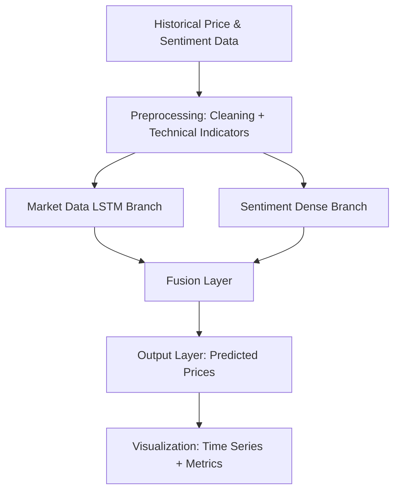

# 📈 Neural Finance: Scientific README

<div align="center">
  
</div>

[](https://www.python.org/downloads/)
[](LICENSE)

---

## 📚 Table of Contents

- [Abstract](#abstract)
- [Introduction](#introduction)
- [Key Scientific Contributions](#key-scientific-contributions)
- [Framework Architecture Diagram](#framework-architecture-diagram)
- [Installation](#installation)
- [Core Functionality](#core-functionality)
- [Model Configuration Example](#model-configuration-example)
- [Validation Metrics](#validation-metrics)
- [Limitations](#limitations)
- [System Requirements](#system-requirements)
- [Legal Disclaimer](#legal-disclaimer)
- [Citation](#citation)

---

## Abstract

**Neural Finance** is a research-oriented deep learning framework for predictive modeling of financial time series. The framework integrates Long Short-Term Memory (LSTM) neural networks with technical indicators and sentiment analysis pipelines, enabling comprehensive temporal modeling of asset prices. It aims to address non-stationary characteristics of financial data, multi-scale temporal dependencies, and the integration of qualitative sentiment information, providing a platform for rigorous scientific experimentation and evaluation.

---

## Introduction

Predicting financial time series remains a fundamentally challenging task due to the stochastic nature of markets, the influence of exogenous events, and inherent noise. Neural Finance was designed to systematically study the efficacy of multi-modal architectures that combine quantitative price-based features with qualitative sentiment signals extracted from external sources. By implementing a modular dual-branch LSTM architecture, the framework facilitates systematic investigation of hypotheses regarding temporal patterns, market sentiment integration, and the predictive utility of technical indicators.

---

## Key Scientific Contributions

* **Hybrid LSTM Architecture**: Dual-branch architecture explicitly separates market data and sentiment data processing before feature fusion, allowing independent and joint hypothesis testing.
* **Adaptive Indicator Framework**: Parameterized computation of technical indicators such as RSI, MACD, MA, EMA, and ROC supports reproducible experimentation with different window sizes and indicator sets.
* **Sentiment Integration Pipeline**: Modular sentiment analysis submodule facilitates controlled integration of external textual signals, enabling ablation studies on the impact of sentiment on predictive performance.
* **Validation Protocols**: Incorporates walk-forward validation, directional accuracy, and error metrics (RMSE, MAE) to support statistically rigorous performance evaluation.

---

## Framework Architecture Diagram



---

## Installation

```bash
git clone https://github.com/melrefaiy2018/neural_finance.git
cd neural_finance
pip install -e .
pip install -r requirements.txt
```

---

## Core Functionality

* **Data Acquisition**: Retrieve historical price data via yfinance API.
* **Technical Indicators**: Compute RSI, MACD, EMA, MA, and ROC with adjustable parameters.
* **LSTM Modeling**: Train and evaluate models with configurable hyperparameters.
* **Sentiment Analysis Framework**: Process external news or social media sentiment for integration into the predictive model.
* **Visualization**: Generate time series plots of true vs predicted prices and technical indicator overlays.
* **Portfolio Analysis**: Evaluate expected returns, volatility, and Sharpe ratios.
* **Web Interface**: Interactive Flask-based application for running analyses without direct scripting.

---

## Model Configuration Example

```python
from neural_finance.config import ModelConfig
from neural_finance import StockAnalyzer

config = ModelConfig(
    lstm_units=128,
    dropout_rate=0.2,
    epochs=100,
    batch_size=32,
    sequence_length=60,
    technical_indicators=['RSI', 'MACD'],
    prediction_horizon=5
)

analyzer = StockAnalyzer(config=config)
```

---

## Validation Metrics

Model performance is quantitatively evaluated using:

* Root Mean Square Error (RMSE)
* Mean Absolute Error (MAE)
* Directional Accuracy (percentage of correct movement predictions)
* Sharpe Ratio (portfolio analysis)

Walk-forward validation is implemented to mitigate look-ahead bias and provide a robust estimate of model generalization on unseen data.

---

## Limitations

* **Sentiment Coverage**: Current implementation supports basic sentiment integration; real-time sentiment ingestion and advanced NLP pipelines remain in development.
* **Backtesting Framework**: Historical strategy simulation is partially implemented, with plans for advanced event-driven backtesting.
* **API Constraints**: Free-tier data sources (e.g., yfinance) impose rate limits and may introduce data latency.

---

## System Requirements

* Minimum: 8GB RAM, multi-core CPU.
* Recommended: 16GB RAM.
* Software: Python 3.8+, TensorFlow 2.x, pandas, numpy, yfinance, scikit-learn, Flask.

---

## Legal Disclaimer

This software is provided for academic research and educational purposes only. It does not constitute investment advice or recommendations. Users are solely responsible for compliance with applicable regulations and for any outcomes resulting from use of the software.

---

## Citation

```bibtex
@software{neural_finance,
  title={Neural Finance: A Scientific Framework for Financial Time Series Prediction},
  author={Elrefaiy, Mohamed A.A.},
  year={2025},
  url={https://github.com/melrefaiy2018/neural_finance},
  version={1.0.0}
}
```

---

Maintainer: Mohamed A.A. Elrefaiy
Contact: [moerelfaiy@gmail.com](mailto:moerelfaiy@gmail.com)
GitHub: [Neural Finance Repository](https://github.com/melrefaiy2018/neural_finance)
